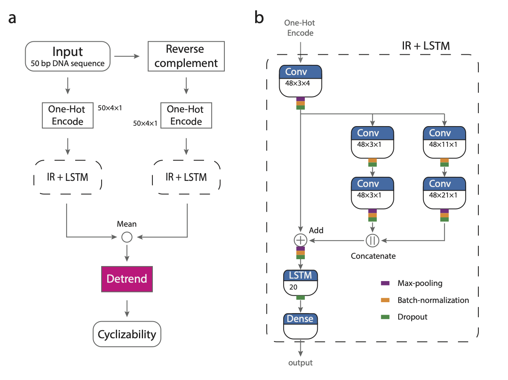

DNAcycP2 R package 
================

**Maintainer**: Ji-Ping Wang, \<<jzwang@northwestern.edu>\>; Brody Kendall \<<curtiskendall2025@u.northwestern.edu>\>; Keren Li, \<<keren.li@northwestern.edu>\>

**License**: Artistic-2.0

**Cite DNAcycP2 package**:

Kendall, B., Jin, C., Li, K., Ruan, F., Wang, X.A., Wang, J.-P., DNAcycP2: improved estimation of intrinsic DNA cyclizability through data augmentation, 2025


## What is DNAcycP2?

**DNAcycP2**, short for **DNA** **cyc**lizability **P**rediction v**2**, is an R package (Python version is also available) developed for precise and unbiased prediction of DNA intrinsic cyclizability scores. This tool builds on a deep learning framework that integrates Inception and Residual network architectures with an LSTM layer, providing a robust and accurate prediction mechanism.

DNAcycP2 is an updated version of the earlier **DNAcycP** tool released by Li et al. in 2021. While DNAcycP was trained on loop-seq data from Basu et al. (2021), DNAcycP2 improves upon it by training on smoothed predictions derived from this dataset. The predicted score, termed **C-score**, exhibits high accuracy when compared with experimentally measured cyclizability scores obtained from the loop-seq assay. This makes DNAcycP2 a valuable tool for researchers studying DNA mechanics and structure.


## Key differences between DNAcycP2 and DNAcycP

Following the release of DNAcycP, it was found that the intrinsic cyclizability scores derived from Basu et al. (2021) retained residual bias from the biotin effect, resulting in inaccuracies (Kendall et al., 2005). To address this, we employed a data augmentation + moving average smoothing method to produce unbiased estimates of intrinsic DNA cyclizability for each sequence in the original training dataset. A new model, trained on this corrected data but using the same architecture as DNAcycP, was developed, resulting in DNAcycP2. This version also introduces improved computational efficiency through parallelization options. Further details are available in Kendall et al. (2025).

To demonstrate the differences, we compared predictions from DNAcycP and DNAcycP2 in a yeast genomic region at base-pair resolution (Figure 1). The predicted biotin-dependent scores ($\tilde C_{26}$, $\tilde C_{29}$, and $ \tilde C_{31}$, model trained separately) show 10-bp periodic oscillations due to biotin biases, each with distinct phases. DNAcycP's predictions improved over the biotin-dependent scores, while still show substantial
local fluctuations likely caused by residual bias in the training data (the called intrinsic cyclizability score $\hat C_0$ from Basu et al. 2021). In contrast, DNAcycP2, trained on corrected intrinsic cyclizability scores, produces much smoother local-scale predictions, indicating a further improvement in removing the biotin bias.

The DNAcycP2 package retains all prediction functions from the original DNAcycP. The improved prediction model, based on smoothed data, can be accessed using the argument smooth=TRUE in the main function (see usage below).


## Available formats of DNAcycP2 and DNAcycP

DNAcycP2 is available in three formats: A web server available at http://DNAcycP.stats.northwestern.edu for real-time prediction and visualization of C-score up to 20K bp, a standalone Python package avilable for free download from https://github.com/jipingw/DNAcycP2-Python, and a new R package available for free download from bioconductor (https://github.com/jipingw/DNAcycP2).


## Architecture of DNAcycP2

The core of DNAcycP2 is a deep learning architecture mixed with an Inception-ResNet structure and an LSTM layer (IR+LSTM, Fig 2) that processes the sequence and its reverse complement separately, the results from which are averaged and detrended to reach the predicted intrinsic score. 




## DNAcycP2 required packages

* `basilisk`
* `reticulate`

## Installation

Current best practice is to install via `devtools` and github:

```r
devtools::install_github("brodykendall/DNAcycP2")
```


## Usage


The **DNAcycP2** R package supports input sequences in two formats:

- **FASTA files**: Sequence names must begin with `>`.
- **R objects**: Input directly as an R object.

Unlike the web server, which processes only one sequence at a time, the R package allows multiple sequences in a single input. For R object inputs, each sequence (≥ 50bp) is treated as an individual input for prediction. However, for best performance, sequences of exactly 50bp are recommended.

### Main Functions

The package provides two primary functions for cyclizability prediction:

1. **`cycle`**: Takes an R object as input.
2. **`cycle_fasta`**: Takes a file path as input.

### Selecting the Prediction Model

Both functions use the `smooth` argument to specify the prediction model:

- **`smooth=TRUE`**: DNAcycP2 (trained on smoothed data, recommended).
- **`smooth=FALSE`**: DNAcycP (trained on original data).

### Parallelization with `cycle_fasta`

The `cycle_fasta` function is designed for handling larger files and supports parallelization. To enable parallelization, use the following arguments:

- **`n_cores`**: Number of cores to use (default: 1).
- **`chunk_length`**: Sequence length (in bp) each core processes at a time (default: 100,000).

We provide two simple example files with the package to show proper usage:

### Example 1: fasta file input

```r
ex1_file <- system.file("data", "ex1.fasta", package = "DNAcycP2")
ex1_smooth <- DNAcycP2::cycle_fasta(ex1_file,smooth=TRUE,n_cores=2,chunk_length=1000)
ex1_original <- DNAcycP2::cycle_fasta(ex1_file,smooth=FALSE,n_cores=2,chunk_length=1000)
```

`cycle_fasta` takes the file path as input (`ex1_file`). `smooth=TRUE` specifies that DNAcycP2 be used to make predictions. `smooth=FALSE` specifies that DNAcycP be used to make predictions. `n_cores=2` specifies that 2 cores are to be used in parallel. `chunk_length=1000` specifies that each core will predict on sequences of length 1000 at a given time.

### Example 2: txt file input

```r
ex2_file <- system.file("data", "ex2.txt", package = "DNAcycP2")
ex2 <- read.csv(ex2_file, header = FALSE)
ex2_smooth <- dnacycp::cycle(ex2$V1, smooth=TRUE)
ex2_original <- dnacycp::cycle(ex2$V1, smooth=FALSE)
```

`cycle` takes the sequences themselves as input where ex2.txt is a text file with each line as a DNA sequence. We first read the file (`ex2_file`) and then provide the sequences as input (`ex2$V1`)

### DNAcycP2 output -- Normalized vs unnormalized

Both `cycle_fasta` and `cycle` output the prediction as a list object. 
Each item in the list (e.g. `ex1_smooth$cycle_1`) is a data.frame object with three columns. The first columns is always `position`. When `smooth=TRUE`, the second and third columns are `C0S_norm` and `C0S_unnorm`; and when `smooth=FALSE` the second and third columns are `C0_norm` and `C0_unnorm`.

In DNAcycP, the model was trained based on the originally called intrinsic cyclizability score ($\hat C_0$ from Basu et al 2021). The prediction based on this is referred to `C0_unnorm`. However the cyclizability socre from different loop-seq libraries may be subject to a systematic library-specific constant difference due to its definition (see  Basu et al 2021), and hence it's a relative measure and not direclty comparable between libraries. Therefore in DNAcycP, we also provided a normalized version of intrinsic cyclizability score. We standardized the $C_0$ score  (to have mean 0, standard deviation 1) from the Tiling Library of loop-seq data before model training. As such the 50 bp sequences from yeast genome roughly have mean 0 and standard deviation =1 for intrinsic cyclizabilty score. Thus for any sequence under prediciton, the normalized C-score can be more informative in terms of its cyclizabilty relative to the population.

Likewise in DNAcycP2, we obtained a improved estimate of intrinsic cyclizability score  of Tiling Library loop-seq data (referred to as $\hat C_0^s$) through data augmentation and smoothing. The prediction results using models trained based on unnormalized and normalized new $\hat C_0^s$ value are referred to as `C0S_norm` and `C0S_unnorm`.


If every sequence has length exactly 50bp, both items in the list will be vectors of doubles corresponding to the predicted value for the sequence at the relevant index.

Otherwise (if there as at least one sequence with length >50bp), both items in the list will be lists of vectors corresponding to the predicted values for each subsequence of length 50bp at the relevant list index. For example, as `ex2` contains 100 sequences each of length 250bp, `ex2_smooth$C0S_norm[[1]]` contains the normalized C-scores for every 50bp subsequence of the first sequence in `ex2` in order. That is, `ex2_smooth$C0S_norm[[1]][1]` corresponds to positions 1-50 of the first sequence in `ex2`, `ex2_smooth$C0S_norm[[1]][2]` corresponds to positions 2-51 of the first sequence in `ex2`, and so forth.

## Other References

* Li, K., Carroll, M., Vafabakhsh, R., Wang, X.A. and Wang, J.-P., DNAcycP: A Deep Learning Tool for DNA Cyclizability Prediction, *Nucleic Acids Research*, 2021

* Basu, A., Bobrovnikov, D.G., Qureshi, Z., Kayikcioglu, T., Ngo, T.T.M., Ranjan, A., Eustermann, S., Cieza, B., Morgan, M.T., Hejna, M. et al. (2021) Measuring DNA mechanics on the genome scale. Nature, 589, 462-467.
